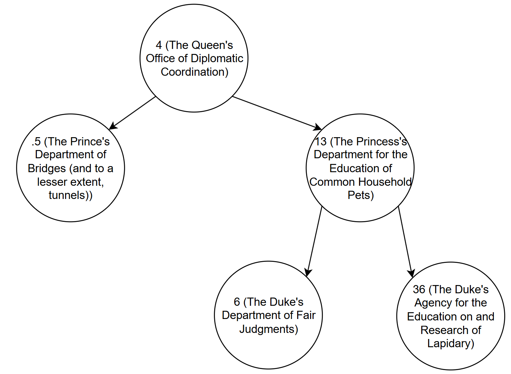

# Directions

This programming project is due April 21st at 3:30pm. You must turn in the program, including documentation, to Gradescope by the due date.

# Introduction
Lord Bug has been defeated! But before Logic (and you, the trusty royal advisor) can celebrate, the King swoops in with his men, and notes the huge pile of stolen gold Lord Bug kept in his lair. While Logic is promised a generous reward, you are promised a huge headache as the distribution of this wealth is placed squarely on your shoulders by the King. You know that the King’s never even heard the term ‘market saturation,’ and the kingdom’s not even on the gold standard anymore. Worst of all, the King demands you prepare an easy-to-understand presentation for the entire court in defense of your proposed wealth distribution plan!

# Problem Description
The Royal Book Club, which boasts most of the court for its membership, recently read “Binary Search Trees: A Solution to All Data-Storage Problems*” on your recommendation. Since your distribution plan has to be easily presented, you decide you’ll use a BST to store the plan information (since it’s easy to turn into a nice graph that the court will understand). Unfortunately, you know that if you present an unbalanced tree, you’ll look unprofessional. Plus, you need to prepare a few different plans, so the court has options to pick from. And you don’t think the King will be very patient about all this. You’ll need to create these BSTs fast. Fortunately, you’ve heard tell of distant data scientists who’ve developed a “self-balancing BST,” called an AVL tree. If you could figure out how to implement one of those, you’d be in the clear!

First, you’ll need to field requests from the different governmental agencies for their ‘fair’ share of the budget increase. Each request will have the name of the agency, the proposed increase, and the current budget of the agency. The names of the agencies always have a prefix with the member of the royal family responsible for the agency. There are currently five members of the royal family in charge of agencies: the Queen, the Prince, the Duke, the Crown Prince, and the Princess. For example, an agency’s name might be: “The Queen’s Agricultural Research Agency”, or “The Crown Prince’s Taxation Office”.

You’ve decided on a simple heuristic for giving out budget increases:

1.	If the agency is run by the Crown Prince, you’ll reject any proposals for budget increases that would increase that agency’s budget by more than 2%. Similarly, 3% for the Princess, 4% for the Prince, 5% for the Queen, and 6% for the Duke. These are the ‘baseline’ budget percentage increases you’re willing to accept.

2.	There are a few keywords that will increase or decrease the ‘baseline’ percentages. If the agency name has “Research”, “Education”, or “Lapidary” in it, you’ll increase the ‘baseline’ percentage by 10% (for each keyword present, up to 30% total). This is your only chance to influence the priorities of the kingdom after all; it’d be a crime not to advance your personal interests a bit. On the other hand, if the agency name has “Personal” in it, decrease the ‘baseline’ percentage by 2%. There are quite a few agencies that are thinly veiled bribery conduits for court members, and they usually have “Personal” in their names.

3.	If the agency has already had a budget increase that’s been approved, reject all other proposed increases for the same agency. You suspect that once you accept a proposal has been approved, the agency will “suddenly” find additional justifications for larger budget increases. You won’t accept any of them.

With those rules in mind, you want to build your AVL tree using the total amount (not the percentage) of the increase for a given agency. This will (hopefully) help downplay the large percentage increases you want to give to smaller agencies. The nodes of your AVL tree should be organized using those budget amounts, and have the agency’s name as additional data. For ties of budget amounts, treat the newly inserted node as though its budget amount was less than the node with the same budget amount already in the AVL tree.

Once you’re done building the AVL tree, you want a way to quickly traverse it in order, printing out the agency names with their associated budget increase amounts.

# Assignment

Write a well-documented, object-oriented program using Java 25 (it is recommended you do a fresh install of Java and whatever IDE you prefer to use) that takes in an input file of budget proposals, and outputs the in-order traversal of the resulting AVL tree, and the height of the tree (described in Output). You must implement an efficient rotation method for inserting new nodes into your AVL tree. You must include in your documentation why you chose the algorithms you did. Name this program: “avl_tree.java”. Your program will be graded on functionality, rotation method efficiency, and on the style guide requirements.

# Input

The input file, taken from a command line argument, will be a .txt file with a series of budget proposals, as shown in this [example input file](program_4_example_input.txt). Your program should run with a command line such as this: “java avl_tree input.txt”.

# Output

Your program should output to the terminal (‘stdout’) the in-order traversal of the AVL tree, given the input file. After the in-order traversal, the program should print the height of the tree. This height is equal to the maximum height of any node in the AVL tree (aka, the height of the deepest level of the tree). The root is considered to be height 0, its child nodes would be of height 1, etc. The output for the example input file would be:

"The Prince's Department of Bridges (and to a lesser extent, tunnels); .5

The Queen's Office of Diplomatic Coordination; 4

The Duke's Department of Fair Judgments; 6

The Princess's Department for the Education of Common Household Pets; 13

The Duke's Agency for the Education on and Research of Lapidary; 36

2"

# Hints

Note that you don’t need to implement any ‘deletion’ functions for the AVL tree.

For an efficient rotation method, consider how you might use recursion (both in the initial search/insertion, then in identifying potential pivots).

You may also share input files with other students, as well as the associated terminal output, to ensure your code is well-tested.

For reference, here is an image of the AVL tree that results from the input file:

